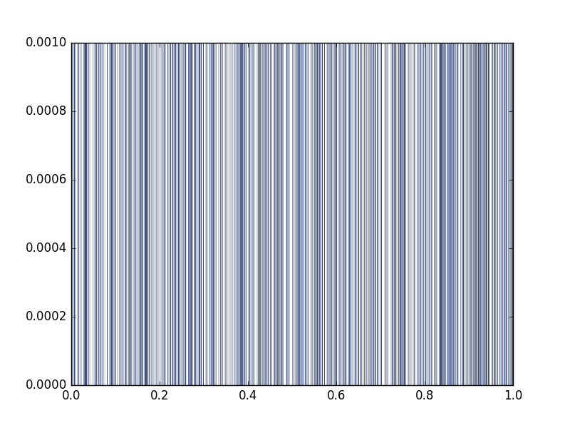
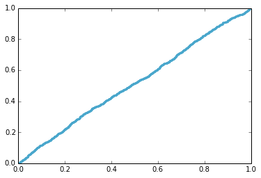

[Think Stats Chapter 4 Exercise 2](http://greenteapress.com/thinkstats2/html/thinkstats2005.html#toc41) (a random distribution)

>> The distribution looks more or less uniform, which is indicated by the linear shape of the CDF.